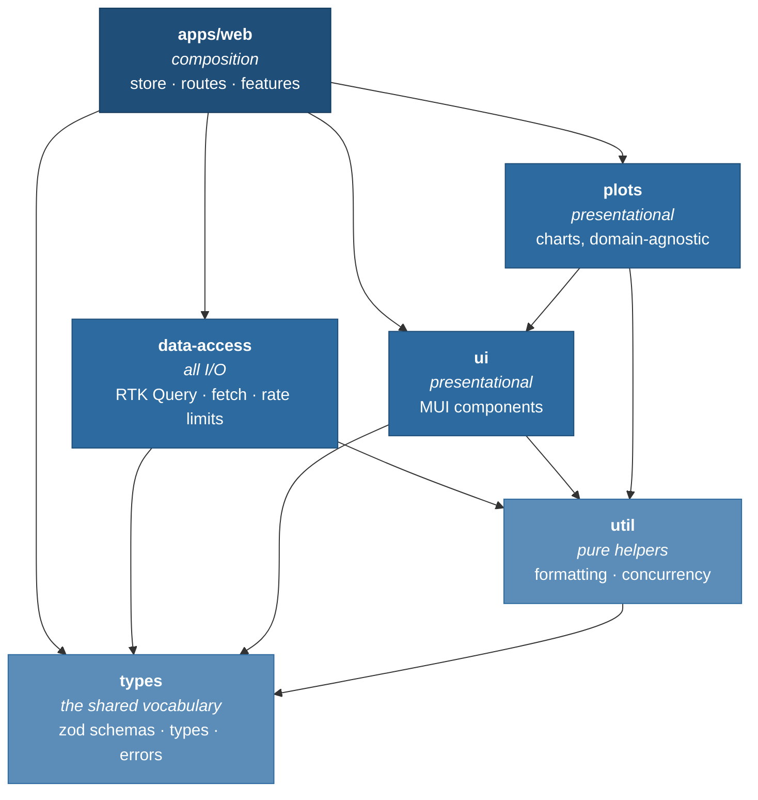
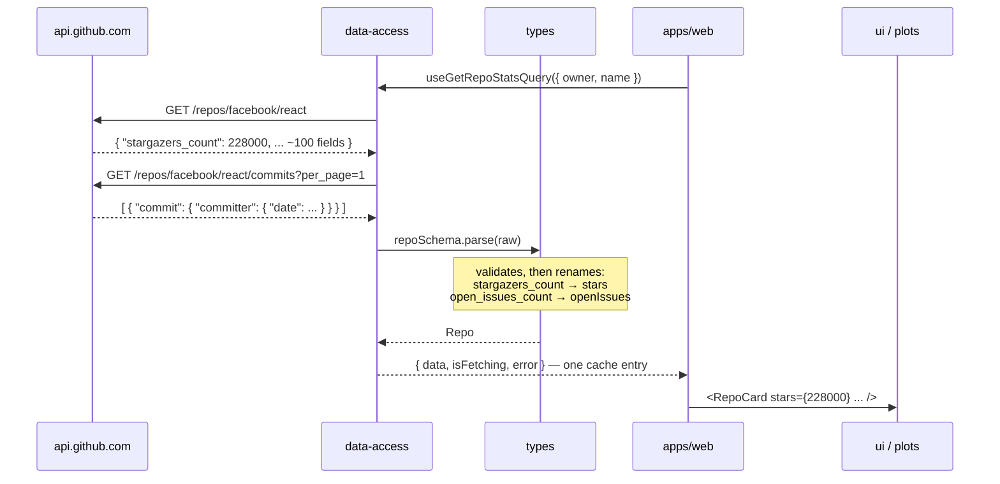

# Architecture

## Package graph

Six packages, split by layer. Every arrow points downwards; the graph is acyclic
by construction.



What the graph forbids, and why:

| Forbidden             | Reason                                                                                                                                         |
| --------------------- | ---------------------------------------------------------------------------------------------------------------------------------------------- |
| `ui` → `data-access`  | A card that renders stars must not drag `fetch`, RTK Query and rate-limit handling with it. Keeps `ui` testable and storyable with no network. |
| `data-access` → `ui`  | The data layer must not know what renders it.                                                                                                  |
| `ui` → redux          | Presentational packages take data as props; connecting happens in `apps/web`.                                                                  |
| anything → `apps/web` | The app is the top of the graph. Nothing composes it.                                                                                          |

`plots` is a **separate package but the same type as `ui`**, following the Nx
convention that many libraries share `type:ui`. Types are rows in the policy
matrix, not per-package labels: two packages need distinct types only when they
need distinct rules.

That `plots` charts stay domain-agnostic — taking `{ label, value }[]` rather
than `RepoStats[]`, so the charting library remains swappable — is therefore a
**convention here, not a lint rule**. What still enforces it mechanically is the
package's own dependency list: `packages/plots/package.json` does not declare
`@repo-radar/types`, so that import does not resolve.

## How enforcement actually works

**The primary boundary is each package's own dependency list.** pnpm does not
hoist, so a package's `node_modules` contains only what its `package.json`
declares. `packages/plots/package.json` does not list `@repo-radar/types`, so
that import fails to resolve — the build breaks before lint runs.

This matters more than it sounds. Much of Nx's tag machinery exists to compensate
for flat, hoisted `node_modules` where every project can reach everything and
only lint stands in the way. With pnpm the hard boundary is free, and it is
per-package, which is the granularity that actually matters.

Two further layers cover what dependency lists cannot express:

1. **`exports` seals each package.** Because every `package.json` declares
   `"exports": { ".": "./src/index.ts" }` rather than `main`, a deep import such
   as `@repo-radar/types/src/schemas` does not resolve at all. The public API is
   the index, enforced by the module resolver.
2. **ESLint** — the dependency matrix restated in one readable place
   (`packages/config/eslint/boundaries.js`), plus the rules no dependency list
   can express: feature isolation inside `apps/web` (including the
   `../settings/x` spelling an IDE autocompletes), `import-x/no-cycle`,
   `import-x/no-relative-packages` so a relative path cannot tunnel into a
   sibling package, and the redux ban on presentational packages.

The lint matrix is deliberately secondary — documentation with teeth, and
`default: 'disallow'` so a package added later is denied until someone writes a
policy for it.

> Getting this to actually work took two corrections worth recording. Element
> patterns must not end in `/**` (that matches files, not the element folder,
> after which the rule classifies nothing and reports nothing), and a TypeScript
> resolver is mandatory — without it neither `boundaries/dependencies` nor
> `import-x/no-cycle` can follow a `.ts` import, so both silently pass
> everything. Both were found by linting a deliberate violation. A rule that
> reports nothing looks exactly like a rule with no violations.

## How one repository flows through the system

This is what `types` is for.



### The question `types` answers

GitHub sends this:

```json
{ "full_name": "facebook/react", "stargazers_count": 228000, "open_issues_count": 950 }
```

Components should receive this:

```ts
{ fullName: 'facebook/react', stars: 228000, openIssues: 950 }
```

Something must define that second shape. `data-access` produces it and `ui`
renders it, so both need the definition. Put it in `data-access` and `ui` must
import the data layer to type a prop; put it in `ui` and `data-access` must
import the component library to type a return value. Either way two siblings get
welded together.

Put it in a package below both and neither needs the other. **`types` is the
contract between the code that fetches and the code that displays.** It imports
nothing but zod.

It holds runtime code as well as declarations — the schemas both validate and
rename:

```ts
export const repoSchema = repoResponse.transform((r) => ({
  fullName: r.full_name,
  stars: r.stargazers_count,
  openIssues: r.open_issues_count,
  // ...
}))

export type Repo = z.infer<typeof repoSchema>
```

**GitHub's wire format stops at this boundary.** Nothing downstream sees
snake_case or knows which API the data came from. Swapping data sources is a
change to this package.

`GithubError` lives here for the same reason: `ui` renders "rate limited" and
"not found" states and cannot reach up into the data layer to learn their shape.

## Smart and dumb components

The package split is the presentational/container separation, enforced
mechanically rather than by convention:

|                       | Package                   | Rule                                                           |
| --------------------- | ------------------------- | -------------------------------------------------------------- |
| Dumb / presentational | `ui`, `plots`             | Props in, callbacks out. Cannot import redux or `data-access`. |
| Smart / container     | `apps/web/src/features/*` | Owns hooks, dispatches, maps domain types to props.            |

`RepoCard` is dumb — storyable, testable, no store. `TrackedRepo` is smart: it
owns `useGetRepoStatsQuery` and maps `RepoStats` onto `RepoCard`'s props.

The distinction is about **dependency direction, not logic**. A dumb component
may hold plenty of logic — formatting, layout state, derived values. What it may
not do is reach the store or the network. (React largely retired the rigid
presentational/container rule after hooks; what re-earns it here is that it now
controls dependencies across package boundaries.)

### When a boundary actually bit

Worth recording, because it came from accessibility rather than architecture.
Link and button text must clear 7:1 contrast, while a chart bar is a non-text
mark needing only 3:1 — so `palette.primary` and the chart colour had to
diverge, and `plots` could no longer read `primary.main` as a shortcut.

The tempting fix was to let `plots` import `ui` for the token. Instead
`StarsBarChart` takes `color` as a prop and `apps/web` passes
`theme.palette.viz.series`. The rule held, and the component came out more
reusable than it went in — which is usually how these resolve.

### Colours that follow the colour scheme

MUI's `cssVariables` mode freezes `theme.palette` to the light scheme; the dark
values exist only as CSS variables. A chart that read `theme.palette` drew its
axis labels at roughly 1.9:1 in dark mode, and nothing failed to tell anyone.

Two small hooks resolve it at the two places that need it:

- **`useChartColors`** (`plots`) returns the label, line and status colours from
  `theme.vars` when present, so the browser resolves them per scheme. It falls
  back to concrete palette values under a plain theme, and depends on nothing
  outside MUI.
- **`useVizPalette`** (`apps/web`) reads the active scheme through
  `useColorScheme` and returns that scheme's `palette.viz` tokens, which are the
  props `plots` receives. It lives in the app because `viz` is a `ui` theme
  extension that `plots` cannot see.

Both have tests that render in dark mode and assert the dark values are the ones
that arrive.

## Requests and cancellation

Every request goes through one limiter in `data-access` (six at a time), so a
cold load of `/tracked` cannot open thirty connections at once regardless of which
component asked. The limiter takes the request's abort signal: a request that is
cancelled while still queued never starts, which is what keeps typing in the
search box from stacking up work behind itself.

`pool` in `util` is a separate, coarser tool used by refresh-all to decide how
many repositories to start. After the first failure it starts nothing new, lets
in-flight work finish, then throws the first error — rejecting immediately would
leave the remaining workers running with nothing left to observe them.

## Facades

RTK Query's generated hooks are already a facade over the store — they hide
dispatch, the cache and the request. A second layer on top of that would be a
facade over a facade, so there isn't one.

Two thin facades do earn their place:

- **`data-access` exports hooks, not the raw `api` slice.** The package boundary
  is the facade.
- **One hook per feature**, e.g. `useTrackedRepos()`, composing the slice
  selector, the query hooks and the refresh-all thunk into a single API.
  Components consume one small surface, and tests get one seam to drive the
  feature through.

No IoC container, no service classes, no provider-injected dependencies.

## Relationship to Nx conventions

Nx defines four library types — `feature`, `ui`, `data-access`, `util` — with
`types`/`model` as a common extension, and constrains them with `type:` and
`scope:` tags. Mapping ours onto that vocabulary:

| Package       | Nx type           | Note                                                |
| ------------- | ----------------- | --------------------------------------------------- |
| `apps/web`    | `app` + `feature` | Features are folders, not libraries — see below     |
| `data-access` | `data-access`     | —                                                   |
| `ui`          | `ui`              | —                                                   |
| `plots`       | `ui`              | A ui-family library with a narrower dependency list |
| `types`       | `types`           | —                                                   |
| `util`        | `util`            | —                                                   |

Three deliberate deviations:

1. **Nothing enforced by tags that a dependency list already enforces.** The
   type matrix follows Nx's canonical constraints — `ui → ui`, `util → types`.
   Finer-grained rules (a chart not importing the repository model, for
   instance) are expressed where they belong: in that package's own
   `package.json`. Under pnpm that is the stronger mechanism, and it is
   per-package, which is the granularity such rules actually have.
2. **No `scope:` dimension.** Nx's second tag separates business domains
   (`scope:orders` vs `scope:billing`). There is one domain here, so every
   package would be `scope:shared` and the tag would carry no information.
3. **Features are folders, not libraries.** Nx orthodoxy wants thin apps with
   features as libraries. At three features this trades six `package.json` files
   for a constraint that lint already provides. The seam is real — promoting a
   feature to a package is a directory move.
